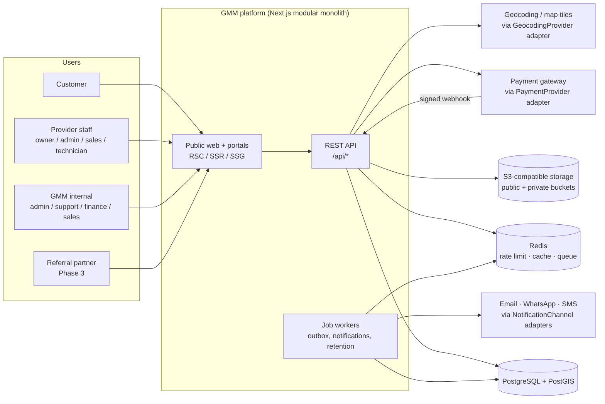

# 01 — Architecture

## 1. System context



Every external dependency (payment gateway, geocoder, map tiles, email/WA/SMS,
storage) sits behind an interface in the owning module's `domain`/`application`
layer, with concrete adapters in `infrastructure`. Business logic never imports a
vendor SDK directly.

## 2. Modular monolith layout

```
src/
  app/                      Next.js routes only (thin): pages, layouts, route handlers
    (public)/ (customer)/ (provider)/ (admin)/ api/
  modules/
    <module>/
      domain/               Pure TypeScript: types, state machines, rules. No I/O, no framework.
      application/          Use cases (commands/queries). Orchestrates domain + ports. Enforces authorization.
      infrastructure/       Drizzle repositories, PostGIS queries, vendor adapters.
      api/                  Zod request/response schemas + route-handler/server-action glue.
  lib/                      Cross-cutting: errors, money, logger, http helpers, auth context.
  db/                       Drizzle schema (per module files), migrations, seed scripts.
  components/               UI components (no business rules).
  jobs/                     Background workers (outbox dispatcher, reminders, retention).
  config/                   Typed env + settings loader.
  tests/                    unit/ integration/ e2e/
```

Dependency rule (enforced by lint `no-restricted-imports` as modules land):

```
api  →  application  →  domain
              ↓
       infrastructure  →  domain
```

- `domain` imports nothing outside `src/lib` pure helpers.
- Modules talk to each other only through another module's `application` public
  functions (or domain events), never through its tables directly.
- Route handlers do: parse input (Zod) → resolve actor → call one use case → map result/error. Nothing else.

### Modules

| Module          | Owns (tables)                                                                                         | Phase                  |
| --------------- | ----------------------------------------------------------------------------------------------------- | ---------------------- |
| `auth`          | sessions, password reset, OTP, login attempts                                                         | 1                      |
| `users`         | users, roles, permissions, role_permissions, user_roles                                               | 1                      |
| `providers`     | providers, provider_users, provider_documents, provider_bank_accounts, provider_status_history        | 1                      |
| `coverage`      | admin_regions, service_areas, coverage_zones, coverage_checks                                         | 1                      |
| `packages`      | internet_packages, package_features, package_coverage_zones, package_price_history                    | 1                      |
| `customers`     | customers, customer_addresses                                                                         | 1                      |
| `orders`        | orders, order_items, order_status_history (+ pricing engine)                                          | 1                      |
| `payments`      | payments, payment_transactions, payment_webhooks, refunds                                             | 1                      |
| `installations` | installations, installation_schedules                                                                 | 1                      |
| `subscriptions` | subscriptions                                                                                         | 1 (info) / 3 (billing) |
| `invoices`      | invoices, invoice_items                                                                               | 3                      |
| `support`       | support_tickets, ticket_messages, ticket_attachments, ticket_status_history                           | 2                      |
| `reviews`       | reviews                                                                                               | 2                      |
| `promotions`*   | promotions, promotion_redemptions (lives in `packages` until it grows)                                | 2                      |
| `notifications` | notification_templates, notifications, notification_preferences                                       | 2                      |
| `cms`           | articles, article_categories, faqs, pages, banners                                                    | 2                      |
| `referrals`     | referral_partners, referral_codes, referral_clicks, referrals, commission_rules, commissions, payouts | 3                      |
| `leads`         | leads, lead_events, lead_assignments                                                                  | 3                      |
| `analytics`     | analytics_events (append-only, partitioned)                                                           | 3                      |
| platform (lib)  | audit_logs, system_settings, idempotency_keys, outbox_events                                          | 1                      |

## 3. Key cross-cutting mechanisms

### 3.1 Authorization (server-side only)

`requirePermission(actor, permission, resource?)` is called inside **every
application use case**, not in UI or middleware alone. Provider-scoped permissions
additionally check `resource.providerId === actor.providerId`. Customers can only
read resources where `resource.customerId === actor.customerId`. Middleware/proxy
redirects are UX only. Details: `docs/06-rbac-matrix.md` (STEP 2).

### 3.2 State machines

Orders, payments, providers, packages, installations, tickets each have an explicit
transition table in `domain/`. Writes go through a single `transition…()` function
that validates the move, checks the actor kind, requires a reason for exception
states, and returns the history row to insert **in the same DB transaction**.

### 3.3 Transactional outbox

Side effects (notifications, analytics, cache invalidation, provider webhooks) are
written as `outbox_events` rows in the same transaction as the state change, then
dispatched by `jobs/outbox-dispatcher`. This keeps notifications out of business
logic and makes them retryable.

### 3.4 Idempotency

- Mutating public APIs (`POST /api/orders`, `POST /api/payments`) accept an
  `Idempotency-Key` header stored in `idempotency_keys` (scope + key unique, request hash, response).
- Payment webhooks are deduplicated by `UNIQUE (gateway, event_id)` in `payment_webhooks`
  and applied through a monotonic status reducer (late/duplicate events are no-ops).

### 3.5 Money

Integer rupiah everywhere (`bigint` in Postgres, `number` checked as safe integer in TS).
Each order stores a frozen `price_snapshot` + `order_items`; later package price
changes never alter existing orders. Financial rows are append-only; corrections are
new rows (adjustment/refund), never updates or deletes.

### 3.6 Audit log

`audit(actor, action, entity, entityId, before, after, ctx)` is written in the same
transaction as the change for every action listed in the brief (§27). `audit_logs` is
insert-only at the DB-permission level (the app role has no UPDATE/DELETE grant).

### 3.7 Coverage engine

1. Geocode/confirm the point (customer pin is the source of truth; geocoder only suggests).
2. Resolve admin area codes (reverse geocode or point-in-region if region polygons are loaded).
3. Single PostGIS query against `coverage_zones` using GiST indexes:
   `ST_Covers(geom, pt)` for polygons, `ST_DWithin(center, pt, radius_m)` for radius,
   area-code equality for admin/manual zones.
4. Pure domain function `evaluateProviderCoverage()` merges matches per provider into
   `AVAILABLE | LIMITED | REQUIRES_SURVEY | NOT_AVAILABLE | UNKNOWN`.
5. Join to eligible packages (provider `VERIFIED`, package `PUBLISHED`, not expired,
   zone-restricted packages filtered).
6. Persist a `coverage_checks` row (for funnel analytics + order linkage); cache the
   result per rounded point (~25 m grid) in Redis for a short TTL.

### 3.8 Payments

```
PaymentProvider (interface, payments/domain)
  ├── MidtransAdapter   (payments/infrastructure)   — STEP 6
  ├── XenditAdapter     (payments/infrastructure)   — STEP 6
  └── FakeGatewayAdapter (tests + local dev only, refuses to load in production)
```

Active adapter is chosen by `PAYMENT_GATEWAY` env. Webhook route:
verify signature → insert `payment_webhooks` (dedupe) → reduce status → transition
order → outbox → 200. Any failure after insert is recorded and retried by a job.

### 3.9 Files

Two buckets: `gmm-public` (logos, covers, article images) and `gmm-private`
(`provider-documents/`, `customers/`, `tickets/`, `reviews/` attachments).
Uploads use pre-signed PUT with size/MIME constraints, then server-side verification
(magic bytes, extension allow-list, size) before the DB row is marked `UPLOADED`.
Downloads of private objects only via short-lived signed GET URLs issued after an
authorization check.

## 4. Rendering strategy

| Surface                               | Strategy                                                                                                    |
| ------------------------------------- | ----------------------------------------------------------------------------------------------------------- |
| Home, about, how-it-works, FAQ, legal | Static (SSG) + on-demand revalidation from CMS                                                              |
| Provider / package detail             | ISR (revalidate on publish/price change via tag)                                                            |
| Search, compare, coverage results     | Dynamic SSR (server filtering), minimal client JS for map + filters                                         |
| SEO landing pages `/internet/[city]`  | ISR, **generated only if** the city has ≥1 verified provider with published packages; otherwise 404/noindex |
| Dashboards (customer/provider/admin)  | Dynamic, authenticated, `no-store`                                                                          |

Map is the only heavy client component; it is lazy-loaded after the user chooses
"pin on map", so the address-search path stays light.

## 5. Environments & deployment (summary — full doc in STEP 12)

- Local: `docker compose up` → Postgres+PostGIS, Redis, MinIO, Mailpit.
- CI: format → lint → typecheck → unit → integration (service containers) → build → E2E.
- Production: container image (Next.js standalone) + separate worker process from the same image,
  managed Postgres with PostGIS, managed Redis, S3-compatible storage, secrets from the platform secret manager.

## 6. Observability

- pino JSON logs with request id, actor id (never name/phone/email), redaction paths for PII and secrets.
- `/api/health` → `{ status, database, timestamp }` only; no versions/hosts.
- Error tracking adapter (Sentry-compatible) with PII scrubbing.
- Health signals for webhook backlog (`payment_webhooks` unprocessed age) and outbox lag.
