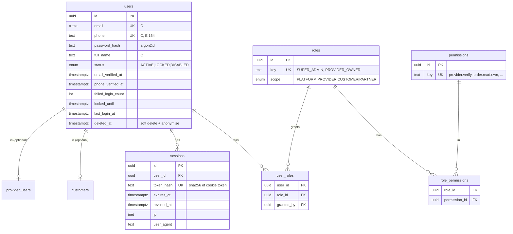
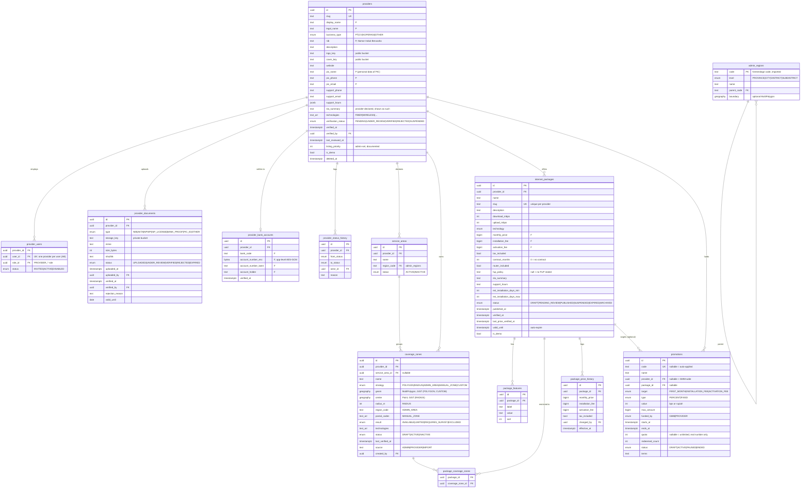
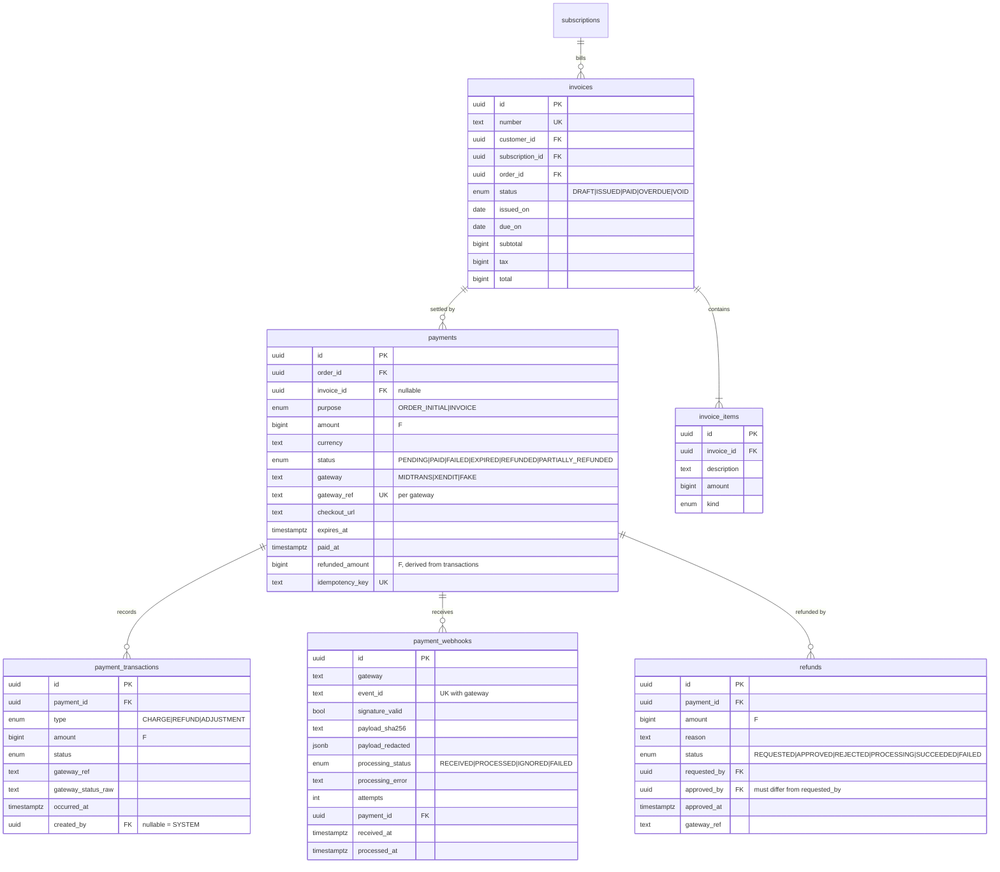
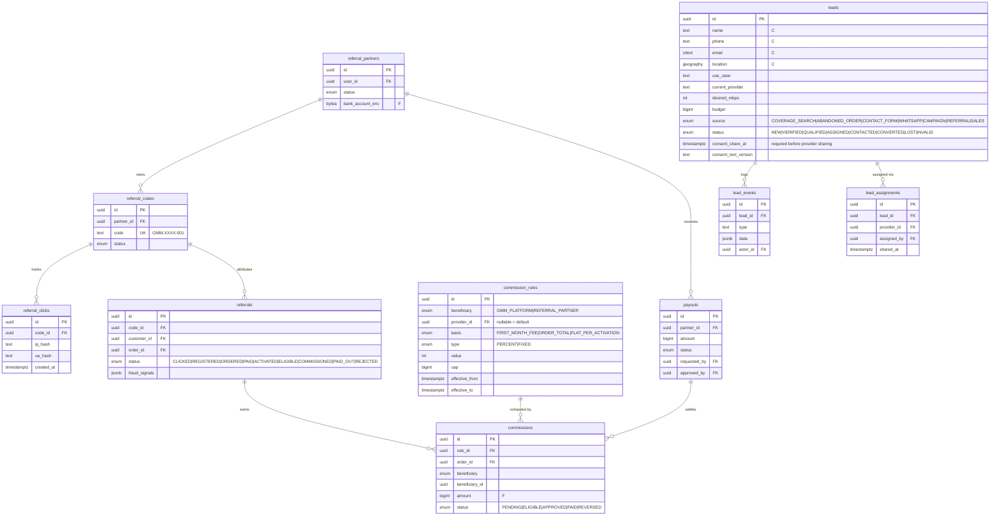

# 02 — Database ERD

PostgreSQL 17 + PostGIS. All ids are `uuid` (v7, time-ordered) unless noted. Every
primary entity has `created_at timestamptz not null default now()` and
`updated_at timestamptz not null` (maintained by the app + trigger). Money columns
are `bigint` rupiah. Enum-like columns are Postgres enums created by migrations.

Legend for data classification (UU PDP separation, see §8):
`[C]` customer personal data · `[P]` provider business data · `[F]` financial · `[I]` internal

## 1. Identity & access



## 2. Providers, coverage, packages



## 3. Customers, coverage checks, orders, installations

```mermaid
erDiagram
  customers ||--o{ customer_addresses : has
  customers ||--o{ orders : places
  coverage_checks ||--o{ orders : "evidence for"
  orders ||--|{ order_items : contains
  orders ||--|{ order_status_history : logs
  orders ||--o| installations : requires
  installations ||--o{ installation_schedules : proposes
  orders ||--o| subscriptions : creates
  orders ||--o{ payments : "paid by"
  providers ||--o{ orders : receives
  internet_packages ||--o{ orders : "ordered as"

  customers {
    uuid id PK
    uuid user_id FK UK
    text full_name "C"
    text phone "C"
    citext email "C"
    timestamptz marketing_consent_at "C, opt-in only"
    timestamptz deleted_at
  }
  customer_addresses {
    uuid id PK
    uuid customer_id FK
    text label
    text formatted_address "C"
    text province_code
    text city_code
    text district_code
    text subdistrict_code
    text postal_code
    geography location "Point, C"
    text access_notes "C, e.g. building/floor"
    bool is_default
  }
  coverage_checks {
    uuid id PK
    uuid user_id FK "nullable (anonymous)"
    text anon_session_id
    geography location "C, retention D9"
    text formatted_address "C"
    text province_code
    text city_code
    text district_code
    text subdistrict_code
    text postal_code
    enum overall_result
    int providers_available
    jsonb provider_results "provider_id -> status, zone ids"
    enum source "SEARCH|GEOLOCATION|PIN"
  }
  orders {
    uuid id PK
    text order_number UK "GMM-YYMMDD-XXXXXX"
    uuid customer_id FK
    uuid provider_id FK
    uuid package_id FK
    uuid address_id FK
    jsonb address_snapshot "C, frozen at order"
    uuid coverage_check_id FK
    enum coverage_result_at_order
    enum status "order state machine"
    jsonb price_snapshot "F, frozen pricing breakdown"
    bigint total_due_today "F"
    bigint recurring_monthly "F"
    text currency "IDR"
    text terms_version
    timestamptz terms_accepted_at
    uuid referral_code_id FK "Phase 3"
    text cancel_reason
  }
  order_items {
    uuid id PK
    uuid order_id FK
    enum kind "MONTHLY_FEE|INSTALLATION_FEE|ACTIVATION_FEE|OTHER_FEE|PROMOTION|DISCOUNT|TAX"
    text description
    bigint amount "F, negative for reductions"
    bool recurring
    bool due_today
    uuid promotion_id FK
  }
  order_status_history {
    uuid id PK
    uuid order_id FK
    enum from_status "nullable for creation"
    enum to_status
    uuid actor_id FK "nullable = SYSTEM"
    enum actor_kind "CUSTOMER|PROVIDER|PLATFORM|SYSTEM"
    text reason
    jsonb metadata
    timestamptz created_at
  }
  installations {
    uuid id PK
    uuid order_id FK UK
    uuid provider_id FK
    uuid technician_user_id FK
    enum status "PENDING_SCHEDULE|SCHEDULED|IN_PROGRESS|QC|COMPLETED|FAILED|CANCELLED"
    jsonb survey_result
    text failure_reason
    timestamptz started_at
    timestamptz completed_at
    timestamptz qc_passed_at
    uuid qc_by FK
  }
  installation_schedules {
    uuid id PK
    uuid installation_id FK
    timestamptz slot_start
    timestamptz slot_end
    enum status "PROPOSED|CONFIRMED|RESCHEDULED|CANCELLED|MISSED"
    uuid proposed_by FK
    timestamptz confirmed_at
  }
  subscriptions {
    uuid id PK
    uuid order_id FK UK
    uuid customer_id FK
    uuid provider_id FK
    uuid package_id FK
    enum status "PENDING_ACTIVATION|ACTIVE|SUSPENDED|CANCELLED"
    bigint monthly_price "F, snapshot"
    enum billed_by "PROVIDER|GMM"
    timestamptz activated_at
    date next_billing_date
  }
```

## 4. Payments & billing (financial — never soft-deleted, append-only where noted)



## 5. Support, reviews, notifications, CMS

```mermaid
erDiagram
  support_tickets ||--o{ ticket_messages : has
  ticket_messages ||--o{ ticket_attachments : has
  support_tickets ||--o{ ticket_status_history : logs
  orders ||--o| reviews : "reviewed in"
  notification_templates ||--o{ notifications : renders
  article_categories ||--o{ articles : groups

  support_tickets {
    uuid id PK
    text ticket_number UK
    uuid customer_id FK
    uuid provider_id FK
    uuid order_id FK
    enum category "NO_INTERNET|SLOW_INTERNET|WIFI_PROBLEM|ROUTER_PROBLEM|INSTALLATION|BILLING|PAYMENT|OTHER"
    enum priority "LOW|NORMAL|HIGH|URGENT"
    enum status "OPEN|ASSIGNED|IN_PROGRESS|WAITING_CUSTOMER|WAITING_PROVIDER|RESOLVED|CLOSED"
    uuid assignee_id FK
    timestamptz first_response_due_at
    timestamptz resolution_due_at
    timestamptz first_responded_at
    timestamptz resolved_at
  }
  ticket_messages {
    uuid id PK
    uuid ticket_id FK
    uuid author_id FK
    enum visibility "PUBLIC|INTERNAL"
    text body "sanitised"
  }
  ticket_attachments { uuid id PK  uuid message_id FK  text storage_key  text mime  int size_bytes }
  ticket_status_history { uuid id PK  uuid ticket_id FK  enum from_status  enum to_status  uuid actor_id FK }
  reviews {
    uuid id PK
    uuid order_id FK UK "one review per order"
    uuid customer_id FK
    uuid provider_id FK
    uuid package_id FK
    int rating "1..5"
    text body
    enum status "PENDING_MODERATION|PUBLISHED|REJECTED|HIDDEN"
    text provider_reply
  }
  notification_templates {
    uuid id PK
    text event "order_created, payment_success, ..."
    enum channel "EMAIL|WHATSAPP|SMS|IN_APP"
    text locale
    text subject
    text body "template, no logic"
    int version
    bool active
  }
  notifications {
    uuid id PK
    uuid user_id FK
    text event
    enum channel
    enum status "QUEUED|SENT|DELIVERED|FAILED|READ"
    jsonb data "minimal, no secrets"
    text vendor_message_id
    timestamptz sent_at
    timestamptz read_at
  }
  articles {
    uuid id PK
    uuid category_id FK
    text slug UK
    text title
    text body_html "sanitised on save"
    text seo_title
    text seo_description
    text og_image_key
    enum status "DRAFT|PUBLISHED|ARCHIVED"
    timestamptz published_at
  }
  article_categories { uuid id PK  text slug UK  text name }
```

Also in CMS: `faqs`, `pages` (homepage blocks, landing pages, legal pages with
`version`), `banners`. Notification preferences: `notification_preferences(user_id, event, channel, enabled)`.

## 6. Phase 3 — referrals, leads, analytics (modelled now, migrated later)



`analytics_events(id bigserial, name, anon_session_id, user_id, properties jsonb, created_at)` — monthly partitions, no raw PII in `properties`.

## 7. Platform tables

| Table              | Notes                                                                                                                                                                                                      |
| ------------------ | ---------------------------------------------------------------------------------------------------------------------------------------------------------------------------------------------------------- |
| `audit_logs`       | `id, actor_id, actor_kind, action, entity, entity_id, before jsonb, after jsonb, ip inet, user_agent, request_id, created_at`. Insert-only (DB grants). `before/after` are redacted for PII/secret fields. |
| `system_settings`  | `key text PK, value jsonb, description, updated_by, updated_at`. Every change audited. Holds tax rate, billing policy, SLA targets, retention periods.                                                     |
| `idempotency_keys` | `scope, key` PK, `request_sha256`, `response_status`, `response_body`, `expires_at`.                                                                                                                       |
| `outbox_events`    | `id, topic, payload jsonb, available_at, attempts, last_error, dispatched_at`.                                                                                                                             |

## 8. Indexing plan (Phase 1)

| Index                                                                                           | Purpose              |
| ----------------------------------------------------------------------------------------------- | -------------------- |
| `coverage_zones USING gist (geom) WHERE status='ACTIVE'`                                        | polygon lookup       |
| `coverage_zones USING gist (center) WHERE status='ACTIVE' AND strategy='RADIUS'`                | radius lookup        |
| `coverage_zones (region_code) WHERE strategy='ADMIN_AREA'`, GIN on `postal_codes`               | admin/manual zones   |
| `internet_packages (provider_id, status)`, `(status, monthly_price)`, `(status, download_mbps)` | search filters/sorts |
| `providers (verification_status) WHERE deleted_at IS NULL`                                      | public listing       |
| `orders (customer_id, created_at desc)`, `(provider_id, status, created_at desc)`               | dashboards           |
| `order_status_history (order_id, created_at)`                                                   | timeline             |
| `payment_webhooks UNIQUE (gateway, event_id)`                                                   | idempotency          |
| `payments UNIQUE (gateway, gateway_ref)`                                                        | reconciliation       |
| `audit_logs (entity, entity_id, created_at)`, `(actor_id, created_at)`                          | audit search         |

## 9. Data classification & separation

| Class                   | Tables                                                                                 | Access                                                                                                       |
| ----------------------- | -------------------------------------------------------------------------------------- | ------------------------------------------------------------------------------------------------------------ |
| Customer personal `[C]` | users, customers, customer_addresses, coverage_checks, orders.address_snapshot, leads  | Customer (own), assigned provider (only for its orders, only fields needed to install), CS/Admin with reason |
| Provider business `[P]` | providers, provider_documents, provider_users                                          | Provider (own), Admin; documents never public                                                                |
| Financial `[F]`         | payments, payment_transactions, refunds, invoices, commissions, payouts, bank accounts | Finance, Super Admin; provider sees own settlement/commission only                                           |
| Internal `[I]`          | audit_logs, system_settings, ticket internal notes, admin metadata                     | Platform roles only; never serialised to public/customer/provider APIs                                       |
