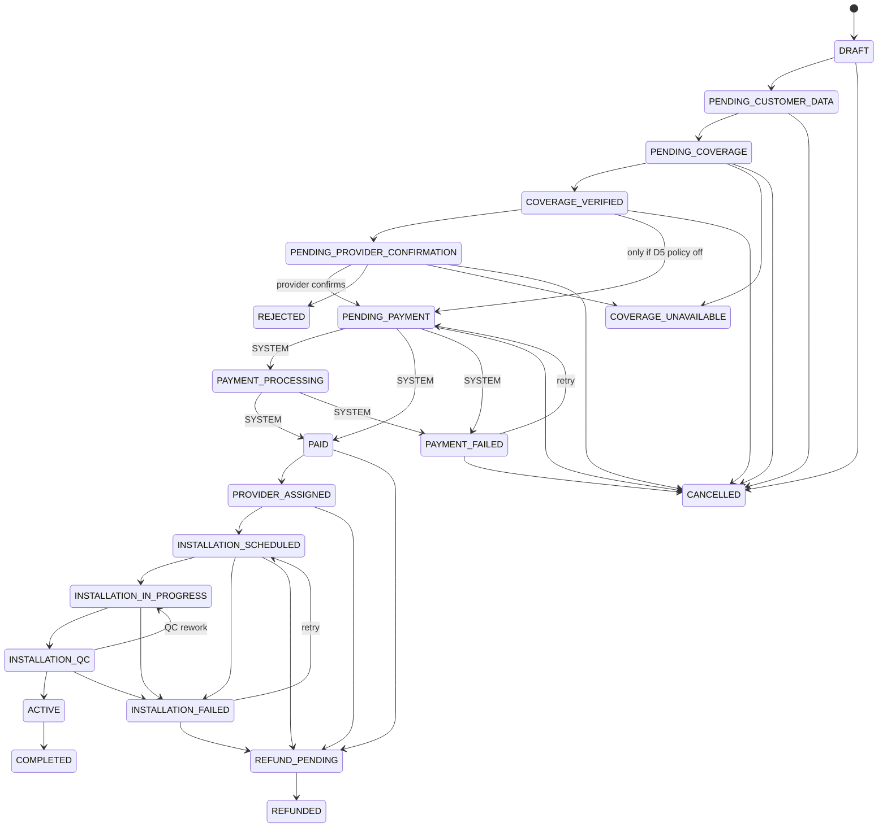

# 03 — Business Rules

Every rule here is implemented as a pure function under `src/modules/*/domain/` and
covered by unit tests (`*.test.ts` next to it). UI components and route handlers
**call** these functions; they never re-implement them.

| Rule                                          | Code                                                                                       | Tests                         |
| --------------------------------------------- | ------------------------------------------------------------------------------------------ | ----------------------------- |
| Order total / price transparency              | `orders/domain/pricing.ts` → `calculateOrderTotal()`                                       | `pricing.test.ts`             |
| Order lifecycle                               | `orders/domain/order-state-machine.ts` → `transitionOrder()`                               | `order-state-machine.test.ts` |
| Coverage decision                             | `coverage/domain/coverage.ts` → `evaluateProviderCoverage()`                               | `coverage.test.ts`            |
| Provider verification & visibility            | `providers/domain/provider-rules.ts`                                                       | `provider-rules.test.ts`      |
| Package publish / listing / purchase          | `packages/domain/package-rules.ts` → `canProviderPublishPackage()`, `canPurchasePackage()` | `package-rules.test.ts`       |
| Payment webhook reduction, refunds, four-eyes | `payments/domain/payment-rules.ts`                                                         | `payment-rules.test.ts`       |
| Subscription activation                       | `subscriptions/domain/subscription-rules.ts` → `canActivateSubscription()`                 | `subscription-rules.test.ts`  |
| Commission                                    | `referrals/domain/commission.ts` → `calculateCommission()`                                 | `commission.test.ts`          |

Shared helpers: `lib/state-machine.ts` (transition tables with actor kinds + mandatory
reasons), `lib/money.ts` (integer rupiah, basis points), `lib/errors.ts` (error codes),
`lib/decision.ts` (allow/deny results).

Domain code may import other modules' **domain** code (pure functions and types),
never their application/infrastructure layers. This is enforced by ESLint.

## 1. Pricing (brief §13)

```
total_today = one_time.total + (charge_first_month_upfront ? first_month.total : 0)

one_time    = installation_fee + activation_fee − reductions + one-time other fees (+ tax)
first_month = monthly_price − first-month reductions + recurring other fees (+ tax)
recurring   = monthly_price + recurring other fees (+ tax)      ← no promotions
```

- **Every mandatory charge is a line from the very first quote.** The quote on the
  package page, the comparison page, and the checkout use the same function.
- Promotions are applied before discounts. Percentages are computed on the component's
  original amount (no compounding). A component never goes below zero.
- Tax is computed per group on the net taxable base, rounded half-up once per group.
  If the package is `tax_included`, the displayed tax is the portion already inside the
  price and is not added again.
- **Missing policy blocks pricing** (`CONFIGURATION_MISSING`): tax rate (D3) and
  first-month-upfront (D4) are never guessed.
- Each order stores a frozen `price_snapshot` + `order_items`. Later price changes do not
  affect existing orders.

Customer-facing breakdown always shows: _Total hari ini_, _Biaya bulanan berikutnya_,
_Diskon/Promo_, _Biaya instalasi_, _Biaya aktivasi_, _Pajak_, _Biaya lain_.

## 2. Order state machine (brief §11)



Rules:

1. Only transitions in the table are allowed (`INVALID_STATE_TRANSITION` otherwise).
2. Each transition lists the **actor kinds** allowed: `CUSTOMER`, `PROVIDER`, `PLATFORM`
   (GMM staff), `SYSTEM` (webhooks/jobs). RBAC role checks happen on top of this.
3. `PAID` and `PAYMENT_FAILED` can only be set by `SYSTEM` (the verified webhook or the
   reconciliation job). No human can mark an order paid.
4. Exception transitions (`CANCELLED`, `REJECTED`, `COVERAGE_UNAVAILABLE`,
   `INSTALLATION_FAILED`, `REFUND_PENDING`, `PAYMENT_FAILED`, QC rework) **require a reason**.
5. After `PAID` there is no "cancel" — the only exit is `REFUND_PENDING → REFUNDED`.
6. Each transition returns an `order_status_history` row that is inserted **in the same
   DB transaction** as the status update, together with the audit log and outbox event.
7. **D5 default:** the provider must confirm feasibility before the customer is asked to
   pay. The `COVERAGE_VERIFIED → PENDING_PAYMENT` shortcut is rejected unless the policy
   is switched off.
8. `SYSTEM` may move `PENDING_COVERAGE → COVERAGE_VERIFIED` only when the coverage engine
   returned `AVAILABLE` (application-layer guard; `LIMITED`/`REQUIRES_SURVEY` need a person).

Customer timeline mapping (brief §14 order): Order Created → Coverage Verified →
Payment → Provider Confirmed (`PROVIDER_ASSIGNED`) → Installation Scheduled →
Installation → Activated. Exception states are rendered from the status history with
their reason.

## 3. Coverage (brief §5)

Strategies per zone: `POLYGON`, `RADIUS`, `ADMIN_AREA`, `MANUAL_ZONE` (postal codes),
`CUSTOM` (provider-supplied geometry). Each zone declares what a match means:
`AVAILABLE`, `LIMITED`, `REQUIRES_SURVEY`, or `EXCLUDED`.

Per provider, in order:

1. Location not resolved, or provider has no active zones → `UNKNOWN`.
2. Any matching `EXCLUDED` zone → `NOT_AVAILABLE` (explicit exclusions always win).
3. No matching zone → `NOT_AVAILABLE`.
4. Keep only the **most specific** matches (CUSTOM > POLYGON = RADIUS > MANUAL_ZONE > ADMIN_AREA).
5. Among those, take the **most conservative** result (REQUIRES_SURVEY < LIMITED < AVAILABLE).
6. If freshness is configured (D13) and all deciding zones are older than the threshold,
   `AVAILABLE` is downgraded to `REQUIRES_SURVEY`.

Orderable statuses: `AVAILABLE`, `LIMITED`, `REQUIRES_SURVEY`. `NOT_AVAILABLE` /
`UNKNOWN` offer "notify me / leave contact" (lead capture with explicit consent, Phase 3).

**UI rule:** every result other than `NOT_AVAILABLE` shows: _"Hasil ini berdasarkan data
area layanan provider. Pemasangan final dapat memerlukan survei teknis oleh provider."_
plus the zone's "last verified" date.

## 4. Providers (brief §8, §16)

- Verification transitions are made by `PLATFORM` only; a provider can only resubmit
  after rejection. Rejection, suspension, reinstatement require a reason.
- Admin can approve only when profile fields (legal name, NIB, PIC name/phone/email,
  address) are filled **and** every required document type is `VERIFIED` and unexpired.
  The required document list is a setting (`providers.required_document_types`) —
  `TODO_BUSINESS_DECISION` with GMM legal.
- Public visibility: `VERIFIED` + `verified_at` set + not deleted + (not demo, unless demo display is on).
- The "Verified Provider" badge requires `VERIFIED` **and** a `verified_at` timestamp.

## 5. Packages (brief §7)

- Submit/publish requires a verified provider and complete customer-facing facts:
  speeds, technology, monthly price > 0, installation & activation fees stated (0 = free),
  contract period stated, support hours, estimated installation range.
- Only `PLATFORM` approves `PENDING_REVIEW → PUBLISHED`.
- Material edits to a published package (price, speed, fees) send it back to
  `PENDING_REVIEW`; the price change is written to `package_price_history` and audited.
- Listed publicly only if `PUBLISHED`, `published_at ≤ now`, not past `valid_until`, and
  the provider is publicly visible. A nightly job moves past-`valid_until` packages to `EXPIRED`.
- Purchasable only if listable **and** coverage at the location is orderable.

## 6. Search ranking (brief §6)

Sorts: `recommended`, `lowest_price`, `highest_speed`, `best_rating`,
`lowest_installation_fee`, `best_value`. No hidden or fake scores:

- `best_value` = monthly price per Mbps download (ascending). Displayed as "Rp/Mbps".
- `best_rating` uses only published reviews; packages with fewer than N reviews
  (setting, `TODO_BUSINESS_DECISION`) are listed after rated ones and labelled "Belum cukup ulasan".
- `recommended` (D12): coverage status (AVAILABLE first) → admin `listing_priority` →
  lowest total first-month cost. The formula is published on the How-it-works page.
  Paid placement, if ever introduced, must carry a visible "Sponsor" label.

Comparison highlights (max 4 packages): _Harga Terendah_ = lowest total today,
_Kecepatan Tertinggi_ = highest download, _Nilai Terbaik_ = lowest Rp/Mbps — always
with the metric shown next to the badge, never as an unexplained claim.

## 7. Payments & refunds (brief §12, §38)

- Webhook handling: verify signature → insert `payment_webhooks` (unique `(gateway, event_id)`)
  → `reducePaymentStatus()` → order transition → outbox → 200.
- Reducer rules: duplicates and stale events (anything after `PAID`) are ignored;
  money arriving after `FAILED/EXPIRED` is recorded as `PAID` but flagged for review;
  an amount/currency mismatch is **never** marked paid (`PAYMENT_AMOUNT_MISMATCH`, manual reconciliation).
- Refund allowed only from `PAID`/`PARTIALLY_REFUNDED`, positive integer amount within the
  remaining refundable balance, and (default, D6) not after activation.
- **Four-eyes**: refunds, payouts, commission adjustments and price overrides need an approver
  different from the requester. Every step is audited. Financial rows are never updated in
  place or deleted; corrections are new rows.

## 8. Subscriptions

Activation (`INSTALLATION_QC → ACTIVE`) requires: order in `INSTALLATION_QC`, initial
payment `PAID`, installation QC passed. The subscription row is created in the same transaction.

## 9. Commissions (D2, D11)

Rules are data: basis (`FIRST_MONTH_FEE` | `ORDER_TOTAL` | `FLAT_PER_ACTIVATION`), type,
value, optional cap, effective window. Bases exclude tax. No rule is seeded — the revenue
model is an open business decision. Commission is created only at activation, in status
`PENDING`, and becomes `ELIGIBLE` after a holding period (setting, `TODO_BUSINESS_DECISION`).

## 10. Reviews (D10 default)

One review per order, only after the order reached `ACTIVE`, moderated before publishing.
Ratings shown on providers/packages are computed from published reviews only, with the
review count always displayed next to the average.
