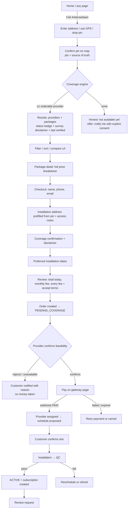
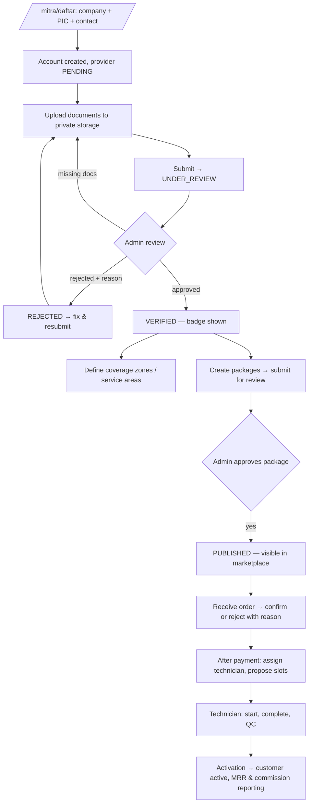
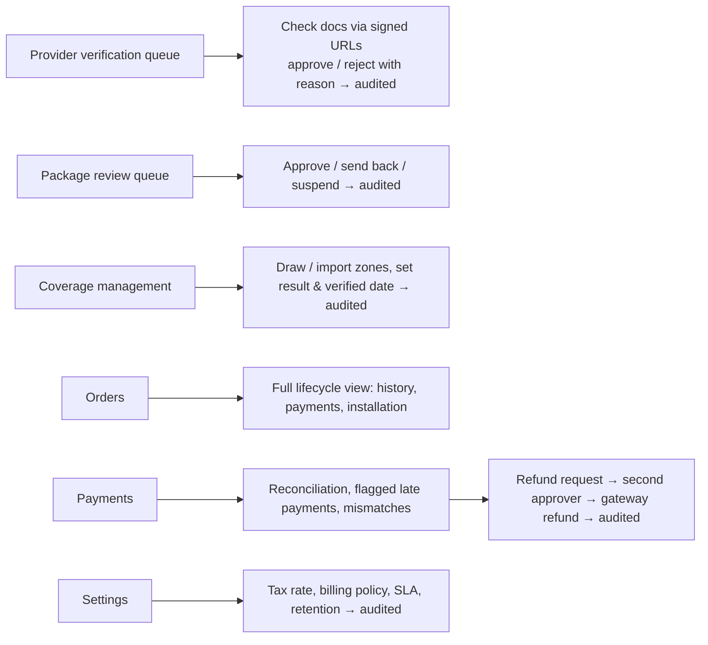
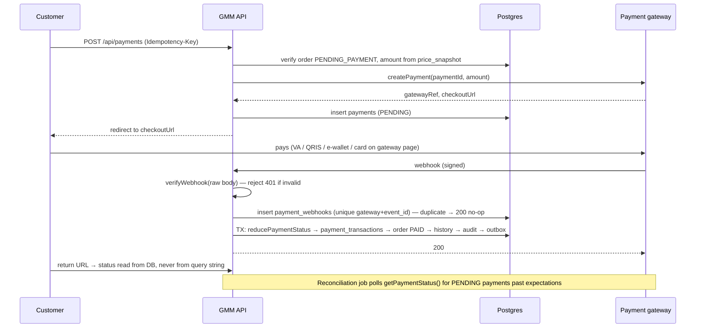
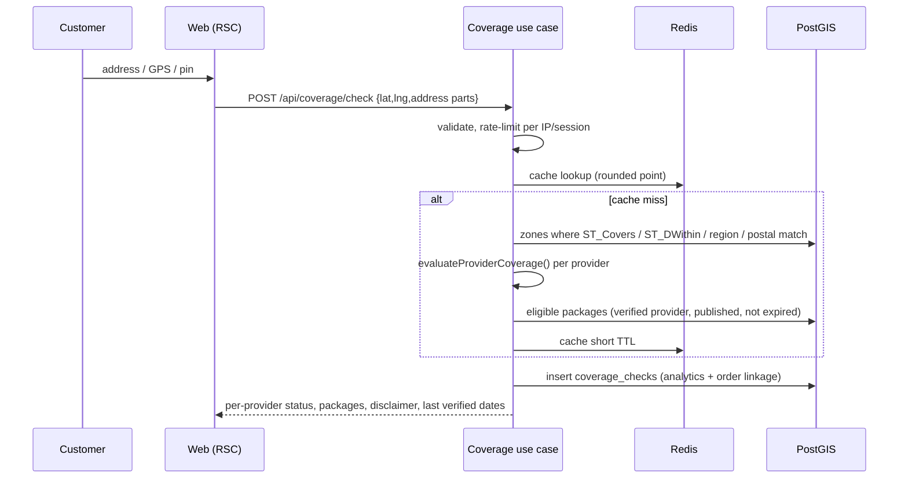
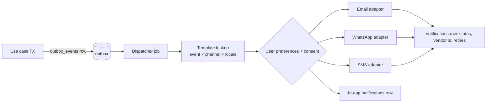

# 05 — User Flows

## 1. Customer: location → active internet

"Customer should know what to do next": every order state has exactly one primary
next action in the dashboard (e.g. _Bayar sekarang_, _Pilih jadwal_, _Tunggu teknisi_).

## 2. Provider onboarding & operations

The provider cannot go live (no public profile, no packages) until `VERIFIED`.

## 3. Admin

## 4. Payment

## 5. Coverage check

## 6. Notifications

Business logic only emits events (`order_created`, `payment_success`, …); templates and
channel selection live in data, not code.
